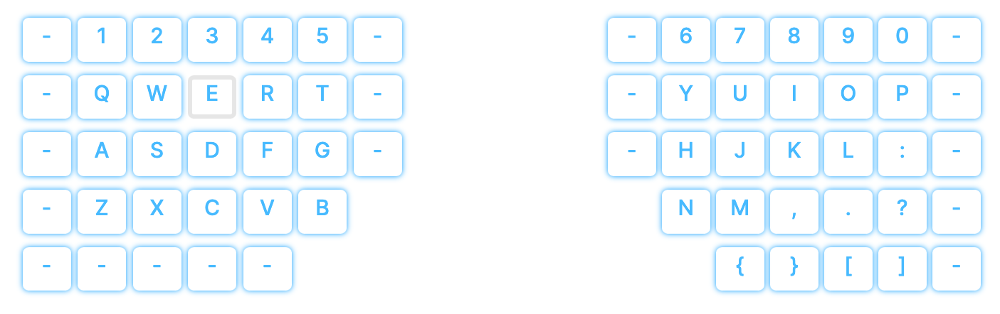
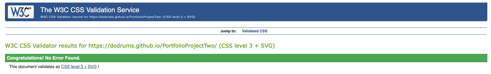

# Moonlander Typing Tutor

## Portfolio Project 2: Javascript Essentials


This project is built as part of the Code Institute Full Stack Software Development course. For this course, Dirk Ornee had to built a second Portfolio Project. Inspired by his recent purchase of a ZSA Moonlander keyboard, he decided to build an app that would help new users get familiar with their Moonlander.

## Live Site

[Moonlader Typing Tutor](https://dodrums.github.io/PortfolioProjectTwo/)

## Github Repository

[PortfolioProjectTwo](https://github.com/DOdrums/PortfolioProjectTwo)

## UX

### Business Goals

The goal of this project, is to develop a helpful typing tutor for people who just purchased the Moonlander keyboard by ZSA. This tutor should make them a bit more comfortable when first starting out with typing on the Moonlander. Besides that, they should have fun in challenging themselves.

### Target Audience

The target audience for this project is anybody who loves to learn touch typing or improve their touch typing skills. However, it is aimed specifically towards people who own a Moonlander keyboard. This keyboard has an ortholinear split layout, which can make it very challenging to start typing on it. To help them out a little bit, they can see a virtual keyboard right below the text box, to show them which key they just typed. This can help them get a better sense of where each key is, without looking down at their fingers.

### User Stories

#### As the owner

* I want to build a helpful tool for people who just bought or already owned the Moonlander.
* I want the user to improve their typing and have data to back that up.
* I want the user to be challenged and have fun.
* I want the user to keep trying and playing with the tutor.
* I want the user to get a good sense of where each letter is on their Moonlander keyboard.

#### As a new user

* I want to easily navigate the website.
* I want to quickly understand the goal of the website.
* I want to train my typing and have data to see if I am improving.
* I want to be able to switch between different modes quickly.
* I want to be able to challenge myself.
* I want to use this tutor to start typing on my Moonlander.

#### As a returning user

* I want to be able to challenge myself again.
* I want to be able to improve on my previous scores.
* I want to train my usage of the Moonlander keyboard.

### Structure of the website

The website is designed to have a good hierarchical flow. After seeing the big header, which immediately makes clear this website is a typing tutor, the user's attention will fall on the sticky notes. These explain the purpose of the website and how to use it. The user will scroll down and start using the tutor. The refresh button is conveniently placed to allow for multiple runs. The site is fully responsive and can be used on any device with a physical or virtual keyboard.

### Color Scheme

The color scheme of this project was not auto generated. Instead, matching colors were selected by the author, and a color palette was made to display them side by side:


### Features

The project is a one page website, making it a fairly simple page in terms of UI. The following features are present from top to bottom:

#### Header

You will be greeted by a header, which shows a nice logo and the title of the website. The header disappears on scroll down and re-appears on scroll up:


#### Sticky Notes

After the header come two sticky notes, one explaining what the site is about and one explaining how to use the tutor:


#### Tutor

After reading the sticky notes, the user should be ready to dive into the actual tutor. User is greeted by the complete interface with on top the question: "Select an option: Text or Code?". This should urge the user to click one of the buttons below:


#### Button

Each button will show a slightly darker color when hovered, reassuring the user this as a clickable element:


#### Text option

After clicking the 'Text' button, user will see text appear and will now be able to type. Once user starts typing, the text will appear green if typed correctly and red if typed incorrectly:


Let's have a look all the data that is in the bottom of the tutor. From right to left:

* 'errors' counts the amount of errors you made while typing. If you hit backspace you can retype a letter, this is implemented to make the typing experience more realistic. However, hitting backspace after incorrectly typing a letter, won't affect the 'errors' value. So, if you want to have 0 errors on your typing test, you should really make 0 errors!
* Next comes the 'acrcy' value, which is an abbreviation of 'accuracy'. This value is calculated with the value from 'errors' and simply shows your accuracy in typing in a percentage value (100% would be 0 errors)
* Next is the WPM value, which stands for 'words per minute'. This value is pretty self explanatory, it calculates how fast you type and displays this in a words per minute value.
* The last little feature is a refresh button. This will return user to the start of the typing tutor, where user gets to pick text or code. Furthermore, all values will be reset back to zero.

#### Code Option

So, the user has just hit the refresh button and is now ready to try the code option! This will bring the user to a similar interface, but instead, they get to type code:


Besides having code to type, there is another difference. Since using a words per minute value when typing code doesn't make a whole lot of sense, the code option displays a timer instead. This timer starts counting up from zero after typing the first key and will stop when you finish the text. This way, the user can challenge themselves to type the piece of code faster next time.

#### Keyboard

Below the tutor, the user can see an animated keyboard. This keyboard resembles the Moonlander keyboard by ZSA and is meant to help the user see which key they are typing, which can be helpful when typing errors happen. The key press is signaled by the key getting a grey inverted box shadow after being pressed (look at the 'E' key).



#### Mobile Buttons

On smartphones, the interface is mostly the same, except that the buttons are now underneath the tutor instead of inside the tutor.


#### Mobile interface

The interface looks the same on mobile, except for the virtual Moonlander keyboard, which has now disappeared to make place for the smartphones own keyboard:


### Futures Features

There is one main feature that could be added in the future, which is the option to let users enter their own string of text to type along with. This would become a submenu of the 'Text' button, which will now show a 'Standard Text' and 'Custom Text' option after being clicked. After clicking 'Custom Text' the user should be able to input their own text. Besides this, hitting the code or text button could cycle multiple strings of text, instead of using the same text for every run.

## Credits

### Code

* For the WPM calculator function two sources were used:
  * [Bobby Hadz Blog](https://bobbyhadz.com/blog/javascript-count-occurrences-of-each-element-in-array) for extracting the amount of words typed by the user.
  * [Reema Alzohairi Blog](https://ralzohairi.medium.com/displaying-dynamic-elapsed-time-in-javascript-260fa0e95049) for calculating the time elapsed.
* To prevent a zoom in on smartphones after the input field is focused, ```user-scalable=no, user-scalable=0``` was used. This solution was found on [Stackoverflow (answer by rebpp)](https://stackoverflow.com/a/11882296/16545052).
* [Stackoverflow (answer by Kristjian)](https://stackoverflow.com/a/13625843/16545052) to make the keyboard size responsive.
* [Creating a timer with JavaScript](https://dev.to/walternascimentobarroso/creating-a-timer-with-javascript-8b7) to built a timer for the coding option of the tying tutor.
* [Hide Navbar on Scroll Down](https://www.w3schools.com/howto/howto_js_navbar_hide_scroll.asp) to make the title bar disappear and appear on scroll.

### Images
  
  [Moonlander logo](https://www.zsa.io/moonlander/) - taken from the ZSA website.

## Technologies used

[HTML](https://html.spec.whatwg.org/) - for basic structuring and semantic markup of the document.

[CSS](https://www.w3.org/Style/CSS/Overview.en.html) - to provide styling to the page.

[JavaScript](https://developer.mozilla.org/en-US/docs/Web/JavaScript) - to write the logic of the tutor.

[Font Awesome](https://fontawesome.com/) - for refresh button.

[Gitpod](https://www.gitpod.io/) - used to connect a browser based VScode to github.

[Github](https://github.com/) - used for version control and deployment of the website.

[Multi Device Website Mockup Generator](https://techsini.com/multi-mockup/index.php) - to create an image of the website shown on different devices.

[Coolors](https://coolors.co/2e6a8a-525050-fffacd-02a6ff-d8f1f2) - for creating a color palette.

## Testing

### Performance testing

The lighthouse tool in Chrome Developer Tools was used to test certain key factors of the website. This was a big help in spotting errors and keeping up with best practices in development. Scores can be seen in the image below:


As you can see, the scores are good, but the Accessibility score could be higher. This is caused by the ```user-scalable=no, user-scalable=0``` in the head element, that is there to prevent unwanted zooming behavior in the tutor when used on smartphones. Unfortunately it's not something that can be removed, so this is the highest the score will get (as this is the only error).

### Compatibility testing

The site was tested by myself on an iPhone 11 pro and a 15 inch Macbook Pro. Friends and family also tested the website on Windows Desktops, the original (small) iPhone SE, and Android devices. The website was also tested in Chrome, Firefox and Safari. One issue was found: the Safari browser doesn't underline spaces in the tutor:


This is a browser specific issue that could not be resolved at this time.

### User Stories testing

* I want to build a helpful tool for people who just bought or already owned the Moonlander.
  * The tutor is a good test for typing ability with a visual aid specifically designed for the Moonlander.
* I want the user to improve their typing and have data to back that up.
  * Data points are given to the user to see how fast and accurate they type and they can improve on this in consecutive runs.
* I want the user to be challenged and have fun.
  * User can challenge themselves in multiple ways by setting goals with the data points.
* I want the user to keep trying and playing with the tutor.
  * Refresh button encourages switching between modes and doing consecutive runs.
* I want the user to get a good sense of where each letter is on their Moonlander keyboard.
  * The visual aid helps the user to identify which key they just typed.

#### As a new user

* I want to easily navigate the website.
  * The website's layout is very simple with a top section and tutor section. The user does not need to navigate the page much or look for features, it's all right there.
* I want to quickly understand the goal of the website.
  * The goal is explained in the first sticky note: 'What is it'.
* I want to train my typing and have data to see if I am improving.
  * The typing tutor gives multiple data points for the user to improve their typing: errors, accuracy and WPM or time.
* I want to be able to switch between different modes quickly.
  * The refresh button gives the user the ability to easily switch between Text and Code mode.
* I want to be able to challenge myself.
  * User gets multiple data points to try and improve their typing abilities in consecutive runs.
* I want to use this tutor to start typing on my Moonlander.
  * Because of the visual on-screen keyboard on the desktop version of this website, the user gets a little help when fist starting out with their Moonlander.

#### As a returning user

* I want to be able to challenge myself again.
  * User can easily return to the tutor a second time, since user can do unlimited runs of the tutor. They can then set new goals, for example maintaining their accuracy above 95% throughout.
* I want to be able to improve on my previous scores.
  * User can keep on trying to improve their previous scores when returning to the tutor a second time.
* I want to train my usage of the Moonlander keyboard.
  * The visual aid and code option helps with getting better at using the Moonlander, since it's a keyboard mostly used by developers.

### Code validation

To validate the code, multiple validators were used:

[Nu Html Checker](https://validator.w3.org/nu/)

Which returned only 1 warning, which again is the ```user-scalable=no, user-scalable=0``` code used in the head. No errors were thrown:


[W3C CSS Validation Service](https://jigsaw.w3.org/css-validator/)

Which returned zero errors:



[JShint](https://jshint.com/)

To validate the JavasScript JShint was used. Besides throwing about a 100 missing semi-colon errors, there were also some undefined variables. After fixing this, JShint comes up completely clean:


### Bugs

* The error 'Uncaught TypeError' would frequently pop up when typing text in the textbox, this was due to the Shift key not being able to be accessed in the DOM (no ID written for any Shift key). Furthermore, any capital letters were also not recognized in the DOM, again because there are not ID's for them. These issues were fixed by writing an extra for loop, eliminating event.key matches for any Shift keys and using the toLowerCase method to make any uppercase letters lowercase before accessing the DOM.
* When scrolling down, the header would disappear behind the textbox. To fix this, the textbox was given a z-index of -1. This however, broke the buttons, since they now weren't clickable anymore. It took a while to find the issue, but eventually it was fixed by removing the z-index from the text box and instead give the header a z-index of 1.

### Deployment

To test the site locally during development, a local host was run in the following way:

* Open terminal within VScode
* enter: ```python3 -m http.server```
* Click "Open in the browser" on the pop-up that appears or enter http://localhost:8000/ in your browser.

To deploy the site live, Github Pages was used. Connected to Github was Gitpod, which features a browser based VScode. For the most part, the connection to Gitpod was made with a desktop VScode, since VIM was used and other extensions as well, which didn't work in the browser based version.

To the deploy the project, I had to:

* Go to settings in github
* Scroll down to Pages
* Select the main branch
* Hit save to deploy the website

## Acknowledgements

This website was built as part of the Full Stack Software Development course from Code Institute. I would like to thank my mentor Adeye Adegbenga, for his excellent feedback and guidance throughout the development of the project. I would also like to thank friends and family, who all took a look at the finished project to make sure it worked well and if I could improve things.
